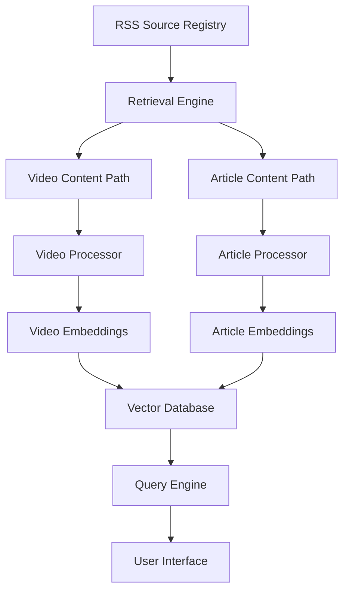

<p align="center">
    <a href="https://github.com/lens-project/lens-engine/issues" alt="GitHub Issues">
        </a>
    <a href="https://github.com/lens-project/lens-engine/actions" alt="GitHub Workflow Status">
        </a>
</p>

# Lens: Content-Aware Feed Aggregator

## Overview

Lens is a next-generation feed aggregator that uses local AI models to intelligently filter, rank, and recommend content from RSS feeds based on user interests. The system distinguishes between different content types (particularly video vs. article content) and uses specialized processing paths for each, learning user preferences for topics and content formats over time.

## Detailed Wiki

[](https://deepwiki.com/lens-project/lens-engine)

## Key Features

- **Content-Type Awareness**: Specialized processing for videos and articles
- **Local AI Processing**: Uses Ollama for privacy-preserving content analysis
- **Natural Language Queries**: Ask for content in plain English
- **Personalized Recommendations**: Learns your preferences over time
- **Command-Line Interface**: Fast, efficient content discovery
- **Functional Programming**: Built with functional programming principles for clarity and maintainability

## Getting Started

### Prerequisites

- [Deno](https://deno.land/) runtime
- [Ollama](https://ollama.ai/) for local AI models
- Recommended models:
  - An embedding model (e.g., nomic-embed-text)
  - A general-purpose LLM (e.g., llama2 or mistral)

### Installation

```bash
# Clone the repository
git clone https://github.com/lens-project/lens-engine
cd lens-engine

# Update environment variables in .env file
cp .env.example .env
```

### Running Tests

```bash
# Run the tests
deno task test
```

## Sample Data

The project includes sample data in the `docs/samples/` directory that demonstrates the complete data flow through the Lens system. This sample data serves multiple purposes:

- **Documentation**: Illustrates how data is structured and transformed at each stage of processing
- **Development**: Provides real-world examples for testing and developing new features
- **Onboarding**: Helps new developers understand the system without setting up their own data environment
- **Reference**: Shows expected input/output formats for each component

The sample data includes:

- **OPML Files**: Feed subscription lists in OPML format (`docs/samples/opml/`)
- **RSS Feeds**: Parsed feed content in JSON format (`docs/samples/feeds/`)
- **Fetched Content**: HTML content from feed items (`docs/samples/fetched/`)
- **Processed Content**: AI-generated summaries and metadata (`docs/samples/processed/`)

The samples feature real, accessible content from Austin Kleon's blog, allowing developers to see the complete journey from feed subscription to processed content with actual working endpoints.

For detailed information on the sample data structure and how to use it in development, see the [Sample Data Guide](docs/samples/README.md).

To run the sample script to initialize the sample data, run the following command from the scripts directory:

```bash
cd scripts
./setup.sh
```

## Architecture

Lens uses a modular architecture with specialized processing paths for different content types:



## Development Status

Lens is currently in active development. See the [project roadmap](docs/prd/roadmap.md) for more details on upcoming features and milestones.

## Update the changelog

Here's a clean step-by-step workflow:

### Release Process with GitHub Codespaces

#### 1. Create the tag on GitHub
- Go to your repository on GitHub.com
- Click **"Releases"** → **"Create a new release"**
- Enter your tag version (e.g., `v1.0.0`) in **"Tag version"**
- Optionally mark as **"Draft"** if you want to polish it later
- Click **"Publish release"** (or **"Save draft"**)

#### 2. Open Codespace from the tagged repository
- Still on your GitHub repo page, click the **"Code"** button
- Switch to **"Codespaces"** tab
- Click **"Create codespace on main"**

#### 3. Update and verify in Codespace

```bash
# Make sure you have the latest changes
git pull origin main

# Verify your new tag is available
git tag --list | grep v1.0.0
```

#### 4. Generate and update changelog

```bash
# Run your changelog script with the new tag
./scripts/changelog.sh v1.0.0

# Copy the script output and paste it into CHANGELOG.md
# (Edit CHANGELOG.md with the generated content)

# Commit the updated changelog
git add CHANGELOG.md
git commit -m "Update changelog for v1.0.0"
git push origin main
```

#### 5. Update release (optional)

- Go back to your GitHub release
- Edit it to include the new changelog content in the release notes

Done! Clean, simple, and no fork complications.

## Contributing

Contributions are welcome! Please see our [contributing guidelines](CONTRIBUTING.md) for more information.

## License

This project is licensed under the MIT License - see the [LICENSE](LICENSE) file for details.

## Acknowledgments

- Built with [Deno](https://deno.land/)
- AI capabilities powered by [Ollama](https://ollama.ai/)
- Inspired by traditional RSS readers and modern AI assistants
